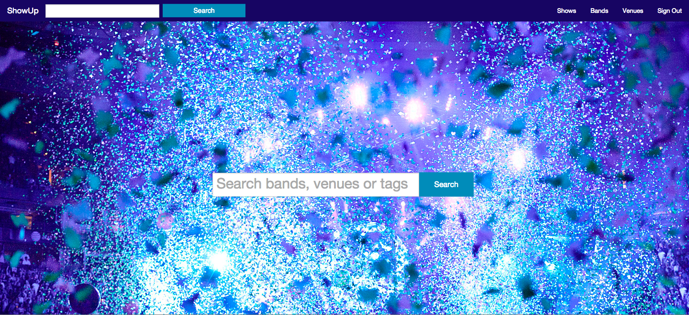

ShowUp is a Ruby on Rails backed concert aggregator that utilizes the Spotify,
SeatGeek and Mapbox apisto get a comprehensive list of shows in Boston with
album art, track listings, location services, for each show.

Other features include up/down voting, tagging, reviewing, searches based on
band name, venue name or any tags associated with the band, venue or show.
